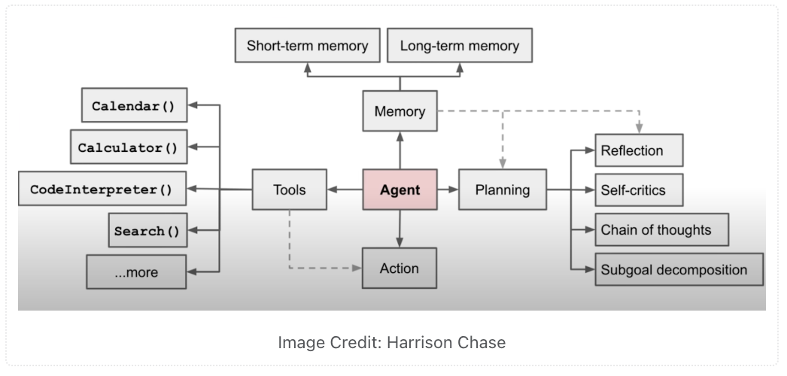
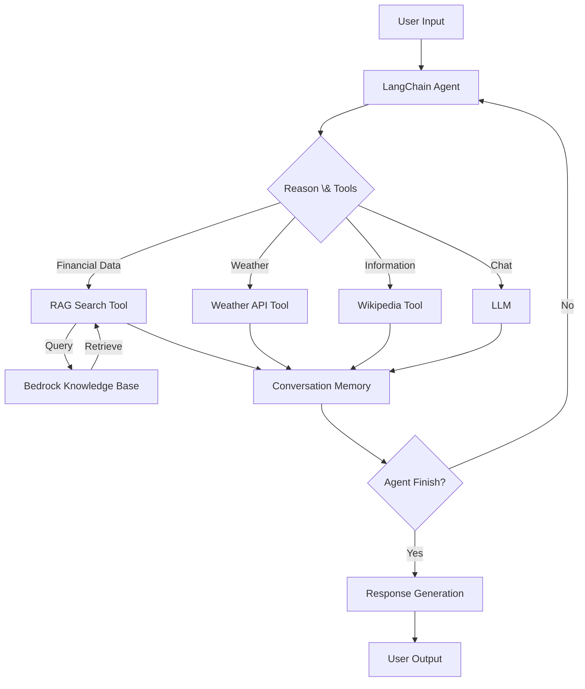

# LangChain Patterns for Building AI Agents

This directory contains examples and patterns for building AI agents using LangChain. 

### Chat Agent with Tool Usage

The chat agent pattern demonstrates how to create an interactive AI assistant that can use external tools.  
Agents use LLMs and have access to tools so that they can chain actions and reasoning to do larger and more complex tasks.

Key implementation components of agents are: tools, memory, planning, and models.



This agent implements the "ReAct" (Reason + Act) pattern, where the agent can:

1. Reason about what tools it needs
2. Act by calling those tools
3. Remember previous actions through the scratchpad
4. Generate appropriate responses based on tool results




#### Components:
1. **Tool Definition**
   - Pydantic models for input validation
   - Type-safe function implementations
   - Clear documentation and error handling

2. **Agent Configuration**
   - Azure OpenAI integration
   - Conversation memory management
   - Tool registration and formatting

3. **UI Integration**
   - Gradio interface for web interaction
   - Async support for responsive UX
   - Error handling and user feedback

4. **Automated Evaluation System**:
   - Response Correctness: Evaluates if responses properly address user queries
   - Tool Usage: Assesses appropriate tool selection and usage
   - Factual Accuracy: Verifies response accuracy against tool outputs

### Best Practices

1. **Type Safety**
   - Python 3.11 type hints throughout
   - Pydantic models for data validation
   - Clear return type definitions

2. **Error Handling**
   - Comprehensive try-except blocks
   - User-friendly error messages
   - Graceful fallbacks

3. **Memory Management**
   - Conversation history tracking
   - Context-aware responses
   - Efficient state management

4. **Tool Integration**
   - Modular tool definitions
   - Clear input/output contracts
   - Reusable components
   - Integration with AWS Bedrock Knowledge Base
   - RAG-based search capabilities

## Implementation Examples

1. `chat_agent.py`: Demonstrates a full chat agent with:
   - Weather lookup capability
   - Wikipedia search integration
   - Financial and real estate RAG search using Amazon Bedrock Knowledge Base
   - Conversation memory
   - Gradio web interface

2. `chat_agent_eval.py`: Enhanced version of chat agent with:
   - All features from chat_agent.py
   - LangSmith integration for response evaluation
   - Evaluation metrics for response correctness, tool usage, and factual accuracy

3. `kb_rag_eval.py`: RAG evaluation module that:
   - Evaluates Q&A performance using Amazon Bedrock Knowledge Base
   - Uses RAGAS framework for comprehensive evaluation metrics
   - Supports metrics like faithfulness, answer relevancy, context precision
   - Saves evaluation results to timestamped CSV files

## Getting Started

1. Ensure you have the required dependencies:
   ```bash
   pip install -r requirements.txt
   ```

2. Set up your environment variables:
   ```bash
   # Azure OpenAI credentials
   AZURE_OPENAI_API_KEY="your_key"
   AZURE_OPENAI_ENDPOINT="your_endpoint"
   AZURE_OPENAI_DEPLOYMENT="your_deployment"
   
   # AWS Bedrock configuration
   AWS_DEFAULT_REGION="us-west-2"
   KNOWLEDGE_BASE_ID="your_kb_id"
   ```

3. Run the chat agent:
   ```bash
   python chat_agent.py
   ```

