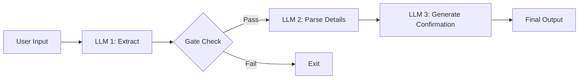
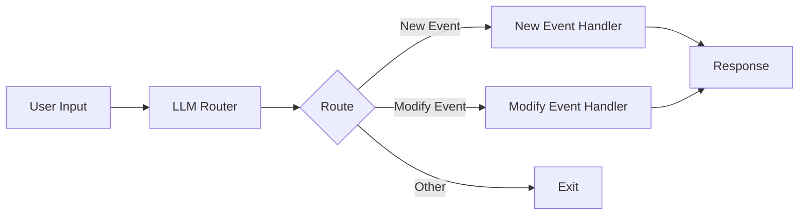
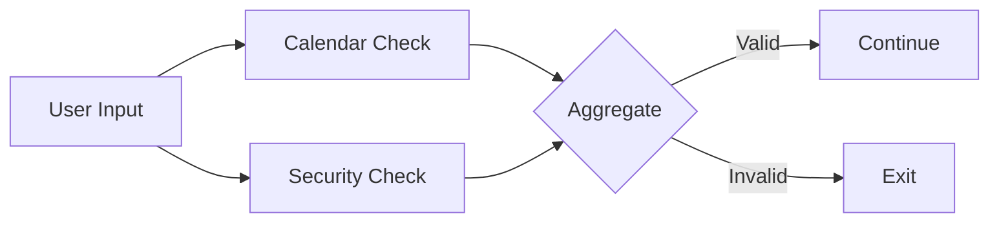

# Workflow Patterns for building AI Agents

Learn more about the theory and practice behind these patterns:
- [Building Effective Agents](https://www.anthropic.com/research/building-effective-agents) - Anthropic's blog post

### Prompt Chaining

Prompt chaining is a powerful pattern that breaks down complex AI tasks into a sequence of smaller, more focused steps. Each step in the chain processes the output from the previous step, allowing for better control, validation, and reliability.

#### Calendar Assistant Example

Our calendar assistant demonstrates a 3-step prompt chain with validation:

#### Step 1: Extract & Validate

- Determines if the input is actually a calendar request
- Provides a confidence score
- Acts as an initial filter to prevent processing invalid requests

#### Step 2: Parse Details

- Extracts specific calendar information
- Structures the data (date, time, participants, etc.)
- Converts natural language to structured data

#### Step 3: Generate Confirmation

- Creates a user-friendly confirmation message
- Optionally generates calendar links
- Provides the final user response

### Routing

Routing is a pattern that directs different types of requests to specialized handlers. This allows for optimized processing of distinct request types while maintaining a clean separation of concerns.

#### Calendar Assistant Example

Our calendar assistant demonstrates routing between new event creation and event modification:

#### Router

- Classifies the request type (new/modify event)
- Provides confidence scoring
- Cleans and standardizes the input

#### Specialized Handlers

- New Event Handler: Creates calendar events
- Modify Event Handler: Updates existing events
- Each optimized for its specific task

### Parallelization

Parallelization runs multiple LLM calls concurrently to validate or analyze different aspects of a request simultaneously.

#### Calendar Assistant Example

Our calendar assistant implements parallel validation guardrails:

#### Parallel Checks

- Calendar Validation: Verifies valid calendar request
- Security Check: Screens for prompt injection
- Run simultaneously for better performance

#### Aggregation

- Combines validation results
- Applies validation rules
- Makes final accept/reject decision

### Orchestrator-Workers

The orchestrator-workers pattern uses a central LLM to dynamically analyze tasks, coordinate specialized workers, and synthesize their results. This creates a flexible system that can adapt to different types of requests while maintaining specialized processing.

#### Blog Writing Example

Our blog writing system demonstrates the orchestrator pattern for content creation:

#### Orchestrator

- Analyzes the blog topic and requirements
- Creates structured content plan
- Coordinates section writing
- Manages content flow and cohesion

#### Planning Phase

- Analyzes topic complexity
- Identifies target audience
- Breaks content into logical sections
- Assigns word count per section
- Defines writing style guidelines

#### Writing Phase

- Specialized workers write individual sections
- Each section maintains context from previous sections
- Follows style and length guidelines
- Captures key points for each section

#### Review Phase

- Evaluates overall cohesion
- Scores content flow (0-1)
- Suggests section-specific improvements
- Produces final polished version

Sample Output:
=== Initial Draft ===

=== Section 1. Introduction ===
Artificial Intelligence (AI) is no longer a futuristic concept confined to science fiction; it has become a pivotal force in reshaping industries across the globe, including software development. As AI technologies continue to evolve, they are increasingly being integrated into the software development lifecycle, offering new tools and methodologies that enhance productivity, accuracy, and innovation. From automating mundane coding tasks to predicting software bugs before they occur, AI is transforming how software is designed, developed, and maintained. This introduction explores the growing importance of AI in software development and provides a glimpse into the various ways it is being utilized to revolutionize the industry. As we delve deeper, we'll explore the current applications of AI that are already making significant impacts.

=== Section 2. Current Applications ===
Artificial Intelligence (AI) is revolutionizing the field of software development by introducing tools and technologies that enhance productivity and efficiency. One of the most significant applications of AI in this domain is automated code generation. Tools like OpenAI's Codex and GitHub Copilot are leading the charge by providing developers with AI-powered code suggestions and completions. These tools leverage large language models to understand natural language prompts and generate code snippets, reducing the time developers spend on routine coding tasks.

In addition to code generation, AI is making strides in automated testing. Traditional software testing can be time-consuming and prone to human error. AI-driven testing tools, such as Testim and Applitools, use machine learning algorithms to create, execute, and maintain test cases. These tools can adapt to changes in the codebase, ensuring that tests remain relevant and effective over time. By automating the testing process, developers can focus on more complex tasks, improving overall software quality and reliability.

Debugging is another area where AI is proving invaluable. Debugging tools like DeepCode and Snyk use AI to analyze code for potential bugs and vulnerabilities. These tools can scan vast amounts of code quickly, identifying issues that might be missed by human developers. By providing insights and recommendations, AI-powered debugging tools help developers fix problems faster and more efficiently.

Overall, the integration of AI into software development processes is not only enhancing productivity but also paving the way for more innovative and robust software solutions. These applications bring numerous benefits, which we will explore in the next section.

=== Section 3. Benefits of AI in Software Development ===
Artificial Intelligence (AI) is revolutionizing the software development landscape by introducing a suite of benefits that enhance the efficiency, accuracy, and capabilities of development processes. One of the most significant advantages AI brings to software development is increased efficiency. AI-powered tools can automate repetitive tasks such as code generation, testing, and debugging, allowing developers to focus on more complex and creative aspects of software creation. This automation not only speeds up the development process but also reduces the time-to-market for new applications.

Moreover, AI significantly reduces errors in software development. By leveraging machine learning algorithms, AI can predict potential bugs and vulnerabilities in the code before they become critical issues. This predictive capability helps in maintaining high-quality code and reduces the need for extensive manual testing, which is often prone to human error. AI-driven testing tools can simulate a wide range of scenarios and edge cases, ensuring that the software is robust and reliable.

AI also enhances the capabilities of software development by providing advanced analytics and insights. These insights can guide developers in making informed decisions about design and architecture, optimizing performance, and improving user experience. AI can analyze vast amounts of data to identify patterns and trends that might not be immediately apparent to human developers, thus enabling more innovative and effective solutions.

Furthermore, AI can improve the entire development lifecycle by facilitating better collaboration and communication among team members. AI-driven project management tools can track progress, predict project timelines, and allocate resources efficiently, ensuring that projects stay on track and within budget. By integrating AI into the development lifecycle, teams can achieve a more streamlined and cohesive workflow, ultimately leading to higher-quality software products.

While these benefits are substantial, it is important to acknowledge the challenges that come with AI integration, which we will discuss next.

=== Section 4. Challenges and Limitations ===
Artificial Intelligence (AI) is revolutionizing software development, offering unprecedented opportunities for innovation and efficiency. However, integrating AI into software development is not without its challenges and limitations. One of the primary concerns is the ethical implications of AI-driven software. As AI systems become more autonomous, questions arise about accountability and transparency. Developers must ensure that AI algorithms are fair, unbiased, and do not perpetuate existing societal inequalities. This requires rigorous testing and validation processes, which can be complex and resource-intensive.

Another challenge is the dependency on AI technologies. While AI can automate many aspects of software development, over-reliance on AI tools can lead to a loss of critical thinking and problem-solving skills among developers. This dependency might also result in a lack of understanding of the underlying processes, making it difficult to troubleshoot or improve AI-driven systems.

Furthermore, the integration of AI in software development raises concerns about job displacement. As AI tools become more capable of performing tasks traditionally done by human developers, there is a fear that jobs may be lost. While AI can augment human capabilities, it is crucial to find a balance that allows for human oversight and creativity, ensuring that AI complements rather than replaces human roles.

Overall, while AI offers significant advantages in software development, it is essential to address these challenges and limitations to harness its full potential responsibly. As we look to the future, addressing these challenges will be key to unlocking new trends and opportunities.

=== Section 5. Future Trends ===
Artificial Intelligence (AI) is poised to revolutionize software development, ushering in a new era of efficiency, creativity, and innovation. Acknowledging the challenges discussed previously, future trends aim to address these issues while maximizing AI's potential. As AI technologies continue to evolve, they are expected to significantly impact various aspects of software development, from coding and testing to deployment and maintenance. One of the most promising trends is the integration of AI-driven tools that can automate repetitive tasks, allowing developers to focus on more complex and creative aspects of software design.

AI-powered code generators and intelligent development environments are already making waves by reducing the time and effort required to write code. These tools can analyze existing codebases, suggest improvements, and even generate new code snippets based on high-level descriptions. This not only accelerates the development process but also enhances code quality by minimizing human error.

Another emerging trend is the use of AI in software testing. AI algorithms can predict potential bugs and vulnerabilities, enabling developers to address issues before they become critical. Machine learning models can analyze vast amounts of data to identify patterns and anomalies, providing insights that were previously unattainable. This predictive capability is set to transform how software is tested, making it more proactive and less reliant on manual intervention.

AI's impact on software deployment and maintenance is also noteworthy. Intelligent systems can monitor applications in real-time, automatically scaling resources and optimizing performance based on user demand. This dynamic approach to resource management ensures that applications remain responsive and efficient, even under fluctuating loads.

Looking ahead, the integration of AI with emerging technologies such as quantum computing and blockchain could further reshape the software development landscape. Quantum computing promises to solve complex problems at unprecedented speeds, while blockchain offers new paradigms for secure and transparent software distribution. AI's role in these technologies could lead to breakthroughs in areas like cryptography, data processing, and decentralized applications.

In conclusion, AI is set to become an indispensable part of software development, driving innovation and efficiency across the industry. As developers embrace these technologies, they will unlock new possibilities and redefine the boundaries of what software can achieve.

Initial Cohesion Score: 0.85

=== Suggested Edits ===

Section: Section 1. Introduction
Suggested Edit: Add a sentence at the end to smoothly transition into the current applications of AI in software development.
Section: Section 2. Current Applications
Suggested Edit: Include a brief mention of the benefits these applications bring, setting up the next section.
Section: Section 3. Benefits of AI in Software Development
Suggested Edit: Conclude with a sentence that acknowledges the challenges, leading into the next section.
Section: Section 4. Challenges and Limitations
Suggested Edit: Add a sentence at the end to transition into future trends, emphasizing the need to address challenges for future growth.
Section: Section 5. Future Trends
Suggested Edit: Begin with a sentence that acknowledges the challenges discussed previously and how future trends aim to address them.

=== Revised Version ===

=== Section 1. Introduction ===
Artificial Intelligence (AI) is no longer a futuristic concept confined to science fiction; it has become a pivotal force in reshaping industries across the globe, including software development. As AI technologies continue to evolve, they are increasingly being integrated into the software development lifecycle, offering new tools and methodologies that enhance productivity, accuracy, and innovation. From automating mundane coding tasks to predicting software bugs before they occur, AI is transforming how software is designed, developed, and maintained. This introduction explores the growing importance of AI in software development and provides a glimpse into the various ways it is being utilized to revolutionize the industry. In the following sections, we will delve into specific applications of AI in software development, highlighting how these advancements are currently being implemented to drive efficiency and creativity.

=== Section 2. Current Applications ===
Artificial Intelligence (AI) is revolutionizing the field of software development by introducing tools and technologies that enhance productivity and efficiency. One of the most significant applications of AI in this domain is automated code generation. Tools like OpenAI's Codex and GitHub Copilot are leading the charge by providing developers with AI-powered code suggestions and completions. These tools leverage large language models to understand natural language prompts and generate code snippets, reducing the time developers spend on routine coding tasks, thereby increasing their productivity.

In addition to code generation, AI is making strides in automated testing. Traditional software testing can be time-consuming and prone to human error. AI-driven testing tools, such as Testim and Applitools, use machine learning algorithms to create, execute, and maintain test cases. These tools can adapt to changes in the codebase, ensuring that tests remain relevant and effective over time. By automating the testing process, developers can focus on more complex tasks, improving overall software quality and reliability.

Debugging is another area where AI is proving invaluable. Debugging tools like DeepCode and Snyk use AI to analyze code for potential bugs and vulnerabilities. These tools can scan vast amounts of code quickly, identifying issues that might be missed by human developers. By providing insights and recommendations, AI-powered debugging tools help developers fix problems faster and more efficiently.

Overall, the integration of AI into software development processes is not only enhancing productivity but also paving the way for more innovative and robust software solutions. These applications bring numerous benefits, such as increased efficiency, reduced error rates, and improved software quality, setting the stage for the next section where we will explore how AI is making software development more accessible to a broader range of developers.

=== Section 3. Benefits of AI in Software Development ===
Artificial Intelligence (AI) is revolutionizing the software development landscape by introducing a suite of benefits that enhance the efficiency, accuracy, and capabilities of development processes. One of the most significant advantages AI brings to software development is increased efficiency. AI-powered tools can automate repetitive tasks such as code generation, testing, and debugging, allowing developers to focus on more complex and creative aspects of software creation. This automation not only speeds up the development process but also reduces the time-to-market for new applications.

Moreover, AI significantly reduces errors in software development. By leveraging machine learning algorithms, AI can predict potential bugs and vulnerabilities in the code before they become critical issues. This predictive capability helps maintain high-quality code and reduces the need for extensive manual testing, which is often prone to human error. AI-driven testing tools can simulate a wide range of scenarios and edge cases, ensuring that the software is robust and reliable.

AI also enhances the capabilities of software development by providing advanced analytics and insights. These insights can guide developers in making informed decisions about design and architecture, optimizing performance, and improving user experience. AI can analyze vast amounts of data to identify patterns and trends that might not be immediately apparent to human developers, thus enabling more innovative and effective solutions.

Furthermore, AI can improve the entire development lifecycle by facilitating better collaboration and communication among team members. AI-driven project management tools can track progress, predict project timelines, and allocate resources efficiently, ensuring that projects stay on track and within budget. By integrating AI into the development lifecycle, teams can achieve a more streamlined and cohesive workflow, ultimately leading to higher-quality software products.

However, while AI offers numerous advantages, it also presents challenges that developers must navigate, such as ethical considerations and the need for continuous learning and adaptation. These challenges will be explored in the next section.

=== Section 4. Challenges and Limitations ===
Artificial Intelligence (AI) is revolutionizing software development, offering unprecedented opportunities for innovation and efficiency. However, integrating AI into software development is not without its challenges and limitations. One of the primary concerns is the ethical implications of AI-driven software. As AI systems become more autonomous, questions arise about accountability and transparency. Developers must ensure that AI algorithms are fair, unbiased, and do not perpetuate existing societal inequalities. This requires rigorous testing and validation processes, which can be complex and resource-intensive.

Another challenge is the dependency on AI technologies. While AI can automate many aspects of software development, over-reliance on AI tools can lead to a loss of critical thinking and problem-solving skills among developers. This dependency might also result in a lack of understanding of the underlying processes, making it difficult to troubleshoot or improve AI-driven systems.

Furthermore, the integration of AI in software development raises concerns about job displacement. As AI tools become more capable of performing tasks traditionally done by human developers, there is a fear that jobs may be lost. While AI can augment human capabilities, it is crucial to find a balance that allows for human oversight and creativity, ensuring that AI complements rather than replaces human roles.

Overall, while AI offers significant advantages in software development, it is essential to address these challenges and limitations to harness its full potential responsibly. Looking ahead, addressing these issues will be crucial for fostering sustainable growth and innovation in the future of AI-driven software development.

=== Section 5. Future Trends ===
While software development faces challenges such as inefficiencies, human error, and resource management, future trends in Artificial Intelligence (AI) aim to address these issues, heralding a new era of efficiency, creativity, and innovation. As AI technologies continue to evolve, they are expected to significantly impact various aspects of software development, from coding and testing to deployment and maintenance. One of the most promising trends is the integration of AI-driven tools that can automate repetitive tasks, allowing developers to focus on more complex and creative aspects of software design.

AI-powered code generators and intelligent development environments are already making waves by reducing the time and effort required to write code. These tools can analyze existing codebases, suggest improvements, and even generate new code snippets based on high-level descriptions. This not only accelerates the development process but also enhances code quality by minimizing human error.

Another emerging trend is the use of AI in software testing. AI algorithms can predict potential bugs and vulnerabilities, enabling developers to address issues before they become critical. Machine learning models can analyze vast amounts of data to identify patterns and anomalies, providing insights that were previously unattainable. This predictive capability is set to transform how software is tested, making it more proactive and less reliant on manual intervention.

AI's impact on software deployment and maintenance is also noteworthy. Intelligent systems can monitor applications in real-time, automatically scaling resources and optimizing performance based on user demand. This dynamic approach to resource management ensures that applications remain responsive and efficient, even under fluctuating loads.

Looking ahead, the integration of AI with emerging technologies such as quantum computing and blockchain could further reshape the software development landscape. Quantum computing promises to solve complex problems at unprecedented speeds, while blockchain offers new paradigms for secure and transparent software distribution. AI's role in these technologies could lead to breakthroughs in areas like cryptography, data processing, and decentralized applications.

In conclusion, AI is set to become an indispensable part of software development, driving innovation and efficiency across the industry. As developers embrace these technologies, they will unlock new possibilities and redefine the boundaries of what software can achieve.

Final Cohesion Score: 0.9