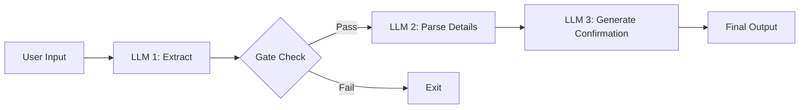
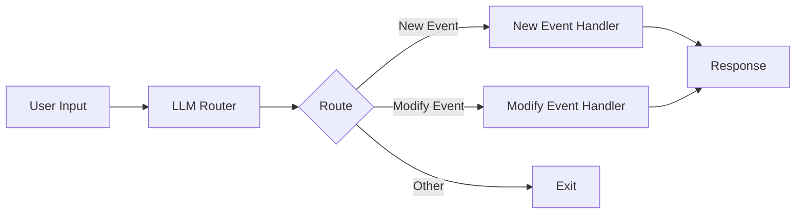
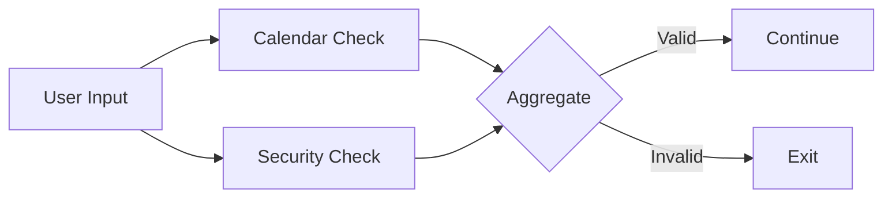

# Workflow Patterns for building AI Agents

Learn more about the theory and practice behind these patterns:
- [Building Effective Agents](https://www.anthropic.com/research/building-effective-agents) - Anthropic's blog post

### Prompt Chaining

Prompt chaining is a powerful pattern that breaks down complex AI tasks into a sequence of smaller, more focused steps. Each step in the chain processes the output from the previous step, allowing for better control, validation, and reliability.

#### Calendar Assistant Example

Our calendar assistant demonstrates a 3-step prompt chain with validation:

#### Step 1: Extract & Validate

- Determines if the input is actually a calendar request
- Provides a confidence score
- Acts as an initial filter to prevent processing invalid requests

#### Step 2: Parse Details

- Extracts specific calendar information
- Structures the data (date, time, participants, etc.)
- Converts natural language to structured data

#### Step 3: Generate Confirmation

- Creates a user-friendly confirmation message
- Optionally generates calendar links
- Provides the final user response

### Routing

Routing is a pattern that directs different types of requests to specialized handlers. This allows for optimized processing of distinct request types while maintaining a clean separation of concerns.

#### Calendar Assistant Example

Our calendar assistant demonstrates routing between new event creation and event modification:

#### Router

- Classifies the request type (new/modify event)
- Provides confidence scoring
- Cleans and standardizes the input

#### Specialized Handlers

- New Event Handler: Creates calendar events
- Modify Event Handler: Updates existing events
- Each optimized for its specific task

### Parallelization

Parallelization runs multiple LLM calls concurrently to validate or analyze different aspects of a request simultaneously.

#### Calendar Assistant Example

Our calendar assistant implements parallel validation guardrails:

#### Parallel Checks

- Calendar Validation: Verifies valid calendar request
- Security Check: Screens for prompt injection
- Run simultaneously for better performance

#### Aggregation

- Combines validation results
- Applies validation rules
- Makes final accept/reject decision

### Orchestrator-Workers

The orchestrator-workers pattern uses a central LLM to dynamically analyze tasks, coordinate specialized workers, and synthesize their results. This creates a flexible system that can adapt to different types of requests while maintaining specialized processing.

#### Blog Writing Example

Our blog writing system demonstrates the orchestrator pattern for content creation:

#### Orchestrator

- Analyzes the blog topic and requirements
- Creates structured content plan
- Coordinates section writing
- Manages content flow and cohesion

#### Planning Phase

- Analyzes topic complexity
- Identifies target audience
- Breaks content into logical sections
- Assigns word count per section
- Defines writing style guidelines

#### Writing Phase

- Specialized workers write individual sections
- Each section maintains context from previous sections
- Follows style and length guidelines
- Captures key points for each section

#### Review Phase

- Evaluates overall cohesion
- Scores content flow (0-1)
- Suggests section-specific improvements
- Produces final polished version

Sample Output:
=== Initial Draft ===

=== Section 1. Introduction ===
Artificial Intelligence (AI) is rapidly transforming the landscape of software development, offering new tools and methodologies that enhance productivity, efficiency, and innovation. At its core, AI refers to the simulation of human intelligence processes by machines, particularly computer systems. These processes include learning, reasoning, problem-solving, perception, and language understanding. As AI technologies continue to evolve, they are becoming increasingly integral to the software development process, providing developers with powerful capabilities to automate tasks, optimize code, and create more intelligent applications.

The relevance of AI in software development today cannot be overstated. With the advent of machine learning algorithms, natural language processing, and neural networks, developers are equipped to tackle complex problems that were previously insurmountable. AI-driven tools can analyze vast amounts of data to identify patterns and insights, enabling developers to make informed decisions and improve software quality. Moreover, AI can automate repetitive tasks, freeing developers to focus on more creative and strategic aspects of their projects. As the demand for smarter, more efficient software solutions grows, AI is poised to play a pivotal role in shaping the future of software development. In the following sections, we will explore the current applications of AI in software development, the benefits it brings, and the challenges it presents.

=== Section 2. Current Applications ===
Artificial Intelligence (AI) is revolutionizing the field of software development by introducing innovative applications that enhance efficiency, accuracy, and predictive capabilities. One of the most significant applications is automated code generation, where AI tools can write code based on high-level descriptions provided by developers. This not only speeds up the development process but also reduces human error. Tools like GitHub Copilot, powered by OpenAI's Codex, are leading the charge in this area, offering developers suggestions and even complete code snippets based on context.

Another critical application of AI in software development is bug detection. AI algorithms can analyze code to identify potential bugs and vulnerabilities before they become issues in production. This proactive approach to quality assurance is exemplified by tools such as DeepCode and Snyk, which use machine learning to scan codebases for errors and security threats, providing developers with actionable insights to improve their code.

Predictive analytics is also gaining traction in software development, helping teams forecast project timelines, resource allocation, and potential risks. AI-driven analytics tools can analyze historical data to predict future outcomes, enabling more informed decision-making. Tools like Jira's predictive analytics features and Microsoft's Azure Machine Learning are empowering developers and project managers to optimize their workflows and anticipate challenges.

These applications not only enhance the efficiency and accuracy of software development but also pave the way for innovative solutions. As AI continues to evolve, its role in software development will likely expand, offering even more sophisticated tools and capabilities.

=== Section 3. Benefits of AI in Software Development ===
Artificial Intelligence (AI) is revolutionizing the software development landscape, offering a myriad of benefits that enhance efficiency, accuracy, and innovation. By automating repetitive tasks, AI allows developers to focus on more complex problem-solving and creative aspects of software creation. This shift not only accelerates the development process but also reduces human error, leading to more reliable and robust software solutions.

One of the primary advantages of AI in software development is its ability to streamline processes. AI-powered tools can automate code generation, testing, and debugging, significantly reducing the time and effort required for these tasks. For instance, AI algorithms can analyze vast amounts of code to identify patterns and suggest optimizations, making the development process faster and more efficient.

Moreover, AI enhances accuracy in software development. Machine learning models can predict potential bugs and vulnerabilities before they become issues, allowing developers to address them proactively. This predictive capability ensures higher quality software and reduces the need for extensive post-release maintenance.

AI also fosters innovation by providing developers with new tools and methodologies. With AI, developers can explore novel approaches to problem-solving, such as using neural networks to create adaptive algorithms or employing natural language processing to improve user interfaces. These innovations can lead to groundbreaking software solutions that were previously unimaginable.

Finally, AI can significantly reduce costs associated with software development. By automating labor-intensive tasks and improving accuracy, AI minimizes the need for extensive manual intervention, thus lowering operational costs. Additionally, the accelerated development timelines enabled by AI mean that products can reach the market faster, providing a competitive edge and increasing potential revenue.

In summary, AI is a powerful ally in software development, offering benefits that streamline processes, enhance accuracy, foster innovation, and reduce costs. Despite these advantages, integrating AI into software development is not without its challenges.

=== Section 4. Challenges and Limitations ===
The integration of Artificial Intelligence (AI) into software development presents a myriad of challenges and limitations that developers and organizations must navigate. One of the primary concerns is the ethical implications of AI-driven software. As AI systems become more autonomous, questions arise about accountability and transparency. Developers must ensure that AI algorithms are designed to avoid biases and discrimination, which requires careful consideration and testing.

Another significant challenge is the dependency on data quality. AI systems rely heavily on large datasets to learn and make decisions. If the data is flawed, incomplete, or biased, the AI's outputs will reflect these issues, potentially leading to inaccurate or harmful results. Ensuring high-quality data is a continuous process that demands rigorous validation and cleansing.

Moreover, the integration of AI into software development necessitates skilled personnel who are proficient in both AI technologies and software engineering principles. The demand for such expertise is high, and the talent pool is limited, making it difficult for organizations to find and retain qualified individuals. This skills gap can hinder the effective implementation of AI solutions and slow down innovation.

These challenges highlight the need for a balanced approach to AI integration, where ethical considerations, data quality, and skill development are prioritized to harness the full potential of AI in software development. Addressing these challenges will be crucial as we look towards the future trends in AI-driven software development.

=== Section 5. Future Trends ===
While challenges exist, the future of AI in software development holds promising trends that could overcome these hurdles. Artificial Intelligence (AI) is poised to revolutionize software development, ushering in a new era of efficiency, creativity, and innovation. As AI technologies continue to evolve, they are expected to significantly impact various aspects of software development, from coding and testing to deployment and maintenance. One of the most promising trends is the integration of AI-driven tools that can automate repetitive tasks, allowing developers to focus on more complex problem-solving and creative aspects of software creation.

AI's ability to analyze vast amounts of data quickly and accurately is transforming how software is tested and debugged. Machine learning algorithms can predict potential bugs and vulnerabilities before they occur, reducing the time and resources spent on manual testing. This predictive capability not only enhances software reliability but also accelerates the development cycle, enabling faster time-to-market.

Moreover, AI is expected to play a crucial role in personalized software development. By leveraging user data, AI can help developers create applications that are tailored to individual user needs and preferences, enhancing user experience and engagement. This trend towards personalization is likely to become more pronounced as AI systems become more adept at understanding and predicting user behavior.

Emerging technologies such as natural language processing (NLP) and generative AI are also set to redefine software development. NLP can facilitate more intuitive human-computer interactions, allowing developers to write code using natural language commands. Generative AI, on the other hand, can assist in creating code snippets or even entire applications based on high-level descriptions, significantly reducing the time and effort required for development.

As AI continues to advance, it will likely lead to the democratization of software development. Tools powered by AI can lower the barrier to entry for non-programmers, enabling more people to create software solutions without extensive coding knowledge. This democratization could lead to a surge in innovation, as diverse perspectives contribute to the development of new applications and technologies.

In conclusion, the future of software development is intricately linked with the advancements in AI. As AI technologies become more sophisticated, they will not only enhance the efficiency and quality of software development but also expand the possibilities of what can be achieved in the digital realm. Developers and organizations that embrace these changes will be well-positioned to lead in the next wave of technological innovation.

Initial Cohesion Score: 0.85

=== Suggested Edits ===

Section: Section 1. Introduction
Suggested Edit: Add a sentence at the end to transition into the current applications of AI in software development, such as: "In the following sections, we will explore the current applications of AI in software development, the benefits it brings, and the challenges it presents."
Section: Section 2. Current Applications
Suggested Edit: Include a sentence that connects the applications to the benefits they provide, such as: "These applications not only enhance the efficiency and accuracy of software development but also pave the way for innovative solutions."
Section: Section 3. Benefits of AI in Software Development
Suggested Edit: Add a transition sentence at the end to lead into the challenges and limitations, such as: "Despite these advantages, integrating AI into software development is not without its challenges."
Section: Section 4. Challenges and Limitations
Suggested Edit: Conclude with a sentence that transitions into future trends, such as: "Addressing these challenges will be crucial as we look towards the future trends in AI-driven software development."
Section: Section 5. Future Trends
Suggested Edit: Begin with a sentence that acknowledges the challenges discussed previously, such as: "While challenges exist, the future of AI in software development holds promising trends that could overcome these hurdles."

=== Revised Version ===

=== Section 1. Introduction ===
Artificial Intelligence (AI) is rapidly transforming the landscape of software development, offering new tools and methodologies that enhance productivity, efficiency, and innovation. At its core, AI refers to the simulation of human intelligence processes by machines, particularly computer systems. These processes include learning, reasoning, problem-solving, perception, and language understanding. As AI technologies continue to evolve, they are becoming increasingly integral to the software development process, providing developers with powerful capabilities to automate tasks, optimize code, and create more intelligent applications.

The relevance of AI in software development today cannot be overstated. With the advent of machine learning algorithms, natural language processing, and neural networks, developers are equipped to tackle complex problems that were previously insurmountable. AI-driven tools can analyze vast amounts of data to identify patterns and insights, enabling developers to make informed decisions and improve software quality. Moreover, AI can automate repetitive tasks, freeing developers to focus on more creative and strategic aspects of their projects. As the demand for smarter, more efficient software solutions grows, AI is poised to play a pivotal role in shaping the future of software development. In the following sections, we will explore the current applications of AI in software development, the benefits it brings, and the challenges it presents.

=== Section 2. Current Applications of AI in Software Development ===
AI is revolutionizing the field of software development by introducing innovative applications that enhance efficiency, accuracy, and predictive capabilities. One of the most significant applications is automated code generation, where AI tools can write code based on high-level descriptions provided by developers. This not only speeds up the development process but also reduces human error. Tools like GitHub Copilot, powered by OpenAI's Codex, are leading the charge in this area, offering developers suggestions and even complete code snippets based on context.

Another critical application of AI in software development is bug detection. AI algorithms can analyze code to identify potential bugs and vulnerabilities before they become issues in production. This proactive approach to quality assurance is exemplified by tools such as DeepCode and Snyk, which use machine learning to scan codebases for errors and security threats, providing developers with actionable insights to improve their code.

Predictive analytics is also gaining traction in software development, helping teams forecast project timelines, resource allocation, and potential risks. AI-driven analytics tools can analyze historical data to predict future outcomes, enabling more informed decision-making. Tools like Jira's predictive analytics features and Microsoft's Azure Machine Learning are empowering developers and project managers to optimize their workflows and anticipate challenges.

These applications of AI are not only transforming how software is developed but also how teams collaborate and innovate. As AI continues to evolve, its role in software development will likely expand, offering even more sophisticated tools and capabilities.

=== Section 3. Benefits of AI in Software Development ===
AI offers a myriad of benefits that enhance efficiency, accuracy, and innovation in software development. By automating repetitive tasks, AI allows developers to focus on more complex problem-solving and creative aspects of software creation. This shift not only accelerates the development process but also reduces human error, leading to more reliable and robust software solutions.

One of the primary advantages of AI in software development is its ability to streamline processes. AI-powered tools can automate code generation, testing, and debugging, significantly reducing the time and effort required for these tasks. For instance, AI algorithms can analyze vast amounts of code to identify patterns and suggest optimizations, making the development process faster and more efficient.

Moreover, AI enhances accuracy in software development. Machine learning models can predict potential bugs and vulnerabilities before they become issues, allowing developers to address them proactively. This predictive capability ensures higher quality software and reduces the need for extensive post-release maintenance.

AI also fosters innovation by providing developers with new tools and methodologies. With AI, developers can explore novel approaches to problem-solving, such as using neural networks to create adaptive algorithms or employing natural language processing to improve user interfaces. These innovations can lead to groundbreaking software solutions that were previously unimaginable.

Finally, AI can significantly reduce costs associated with software development. By automating labor-intensive tasks and improving accuracy, AI minimizes the need for extensive manual intervention, thus lowering operational costs. Additionally, the accelerated development timelines enabled by AI mean that products can reach the market faster, providing a competitive edge and increasing potential revenue.

In summary, AI is a powerful ally in software development, offering benefits that streamline processes, enhance accuracy, foster innovation, and reduce costs. Despite these advantages, integrating AI into software development is not without its challenges.

=== Section 4. Challenges and Limitations ===
The integration of AI into software development presents a myriad of challenges and limitations that developers and organizations must navigate. One of the primary concerns is the ethical implications of AI-driven software. As AI systems become more autonomous, questions arise about accountability and transparency. Developers must ensure that AI algorithms are designed to avoid biases and discrimination, which requires careful consideration and testing.

Another significant challenge is the dependency on data quality. AI systems rely heavily on large datasets to learn and make decisions. If the data is flawed, incomplete, or biased, the AI's outputs will reflect these issues, potentially leading to inaccurate or harmful results. Ensuring high-quality data is a continuous process that demands rigorous validation and cleansing.

Moreover, the integration of AI into software development necessitates skilled personnel who are proficient in both AI technologies and software engineering principles. The demand for such expertise is high, and the talent pool is limited, making it difficult for organizations to find and retain qualified individuals. This skills gap can hinder the effective implementation of AI solutions and slow down innovation.

Addressing these challenges will be crucial as we look towards the future trends in AI-driven software development, where ethical considerations, data quality, and skill development are prioritized to harness the full potential of AI.

=== Section 5. Future Trends and Conclusion ===
While challenges exist, the future of AI in software development holds promising trends that could overcome these hurdles. AI is set to revolutionize the field by enhancing efficiency, creativity, and innovation. As AI technologies evolve, they are expected to significantly impact various aspects of software development, from coding and testing to deployment and maintenance. One of the most promising trends is the integration of AI-driven tools that can automate repetitive tasks, allowing developers to focus on more complex problem-solving and creative aspects of software creation.

AI's ability to analyze vast amounts of data quickly and accurately is transforming how software is tested and debugged. Machine learning algorithms can predict potential bugs and vulnerabilities before they occur, reducing the time and resources spent on manual testing. This predictive capability not only enhances software reliability but also accelerates the development cycle, enabling faster time-to-market.

Moreover, AI is expected to play a crucial role in personalized software development. By leveraging user data, AI can help developers create applications that are tailored to individual user needs and preferences, enhancing user experience and engagement. This trend towards personalization is likely to become more pronounced as AI systems become more adept at understanding and predicting user behavior.

Emerging technologies such as natural language processing (NLP) and generative AI are also set to redefine software development. NLP can facilitate more intuitive human-computer interactions, allowing developers to write code using natural language commands. Generative AI, on the other hand, can assist in creating code snippets or even entire applications based on high-level descriptions, significantly reducing the time and effort required for development.

As AI continues to advance, it will likely lead to the democratization of software development. Tools powered by AI can lower the barrier to entry for non-programmers, enabling more people to create software solutions without extensive coding knowledge. This democratization could lead to a surge in innovation, as diverse perspectives contribute to the development of new applications and technologies.

In conclusion, the future of software development is intricately linked with the advancements in AI. As AI technologies become more sophisticated, they will not only enhance the efficiency and quality of software development but also expand the possibilities of what can be achieved in the digital realm. Developers and organizations that embrace these changes will be well-positioned to lead in the next wave of technological innovation.

Final Cohesion Score: 0.85
